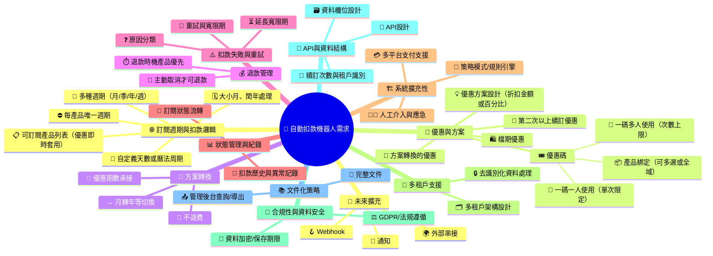

# 自動扣款機器人需求說明書 (v0.5)

## 心智圖總覽

---

# 自動扣款機器人需求說明書

---

## 主題：訂閱週期與扣款邏輯

### 標題：訂閱扣款週期可自定義
- **描述：** 
  1.  **支援「曆法週期」** 如月、年、季、週等多種扣款週期，週期從訂閱開始日計算。須正確處理大小月、閏年。
  2.  **支援「固定天數」** 如30日
- **備註：** 「曆法週期」例：1/31 訂閱，2月扣款日為2/28（或2/29），下期為3/31。

### 標題：每個產品唯一扣款週期
- **描述：** 每個訂閱產品僅能綁定一種扣款週期，不得變更。
- **備註：** 若需提供不同週期，需定義為不同產品。

### 標題：可訂閱產品列表與優惠套用
- **描述：** 使用者可查詢可訂閱的產品列表。查詢結果需即時反映優惠金額。但若使用者已訂閱某產品，則只能取得與現有訂閱不同的產品列表。
- **備註：** 系統需檢查使用者目前狀態並過濾相同產品。

---

## 主題：優惠與方案

### 標題：優惠方案設計
- **描述：** 
   **系統原則：僅套用單一優惠**。無論優惠類型為何，系統始終依優先級選擇並套用最高優先級的單一優惠，不支援多重優惠疊加。
   1. 支援優惠活動（如第一期免費、特定週期優惠、原價恢復等），可為優惠設定優先級。
   2. 每種優惠需明確定義開始與結束時間。
   3. 多重優惠，以優先級處理。優先級順序為：用戶手動優惠（如優惠碼）> 其他優惠（如檔期優惠、續訂優惠）> 系統自動優惠（如首次訂閱折扣）。若相同優先級，則套用計算後金額較高者。
   4. 支援「固定折扣金額」、「百分比折扣」與「固定結帳金額」
   5. **優惠方案能綁定特定產品，產品可多選或不指定（全域適用）**
- **備註：** 例如：固定折扣100元，或打七折 (30% off)。當優惠綁定特定產品時，只能在訂閱該產品時套用。

### 標題：優惠碼機制
- **描述：** 優惠碼可指定優惠價格及優惠期數。分為：
  1. **一碼多人使用**：可設定總使用次數上限。
  2. **一碼一人使用**：每位使用者僅能使用一次，不得重複使用。
  3. **優惠碼能限制只適用於特定產品，產品可多選或不指定（全域適用）**
- **情境一：共用優惠碼（多用戶可用、單次限用、含消費門檻）**
  - 行銷活動期間，系統管理員建立單一優惠碼（如 ANNIV100），供多位會員使用。每位會員僅能使用一次，需達最低消費金額才可折抵。
  - 支援建立單一優惠碼，設定最低消費金額與折扣值。
  - 系統於結帳時檢核金額門檻、使用次數與有效期限。
  - 已使用會員不可再用，其他會員仍可繼續使用。
  - 優惠碼狀態可於後台查詢、停用或修改。
- **情境二：獨立優惠碼（專屬代碼、一次性、無門檻）**
  - 系統管理員建立優惠計劃，批次生成多組唯一優惠碼。客服人員將代碼個別發送給不同會員，每組代碼僅能使用一次，無消費門檻限制。
  - 支援優惠計劃建立與批次生成多組唯一代碼。
  - 每組代碼可綁定至特定會員或留待客服分配。
  - 使用後自動標記為「已使用」，不可重複。
  - 後台可查詢各代碼的使用者與使用狀態。
- **備註：** 需記錄使用紀錄以防止重複使用或超出次數。系統需支援消費門檻檢查、用戶重複使用防護及後台管理功能。當優惠碼限制特定產品時，只能在訂閱該產品時使用。

### 標題：第二次以上續訂優惠
- **描述：** 針對第二次及以上續訂的用戶，提供專屬優惠方案（如折扣價格或額外贈送期數）。優惠可依產品或方案設定，並與其他優惠（如優惠碼或檔期優惠）比較優先級。
- **備註：** 需記錄用戶續訂次數以判定資格。

### 標題：方案轉換時的優惠處理
- **描述：** 當用戶進行方案轉換（如從月方案轉為年方案），下一個扣款週期以新方案的原價計費，僅允許套用優惠碼（若有）。第二次及以上續訂週期開始適用「第二次以上續訂優惠」規則。
- **備註：** 需確保系統正確追蹤續訂次數及方案轉換後的優惠適用邏輯。

---

## 主題：方案轉換

### 標題：方案切換支援
- **描述：** 支援用戶將訂閱從月方案轉為年方案等，轉換後自下個週期生效，原方案未到期不返還剩餘金額。
- **備註：** 剩餘優惠期數將依新方案週期承接。

---

## 主題：退款管理

### 標題：退款條件與流程
- **描述：** 僅允許用戶主動取消時申請全額退款，退款時機可依產品設定與全域設定雙軌設計，產品設定優先。
- **備註：** 參考試用期退款設計。

---

## 主題：扣款失敗與重試

### 標題：扣款失敗重試與寬限期
- **描述：** 
   1. 扣款失敗時需根據失敗原因分類，支援重試（如網路錯誤）、延後重試（如餘額不足）、不可重試（如卡片停用）。重試次數與寬限期依產品設定，無設定則以全域預設。
   2. 重試間隔設定為 1 小時，不進入寬限期。最大重試次數為 3 次，重試達 3 次後進入寬限期。
   3. 特定失敗原因（如卡片過期、餘額不足）不進行重試，直接進入寬限期。其他失敗原因（如網路錯誤）按重試規則處理。 
   4. 寬限期設定為 7 天。
- **備註：** 寬限期內用戶若手動補款則無需再重試。

---

## 主題：狀態管理與資料紀錄

### 標題：訂閱狀態與生命週期
- **描述：** 明確定義訂閱各階段（如：待生效、已生效、寬限期、已取消、退款中等），及狀態流轉規則。
- **備註：** 狀態流轉需與扣款、退款、方案異動等流程密切結合。

### 標題：扣款歷史與異常記錄
- **描述：** 必須詳實記錄每次扣款、異常、重試、人工介入等操作。
- **備註：** 需補強以支援完整追蹤與申訴。

---

## 主題：系統擴充性與彈性

### 標題：策略模式與規則引擎
- **描述：** 扣款、優惠、重試、退款等規則需設計為可擴充（策略模式或規則引擎），支援日後新增或調整。
- **備註：** 可針對不同產品/方案做差異化設定。

### 標題：多平台支付支援
- **描述：** 支援多種支付方式（如信用卡、電子支付等）。

### 標題：人工介入與應急流程
- **描述：** 設計人工介入流程以處理例外狀況。

---

## 主題：多租戶支援

### 標題：多租戶架構設計
- **描述：** 支援多租戶架構，確保不同租戶的訂閱資料與規則隔離。
- **備註：** 租戶可自定義扣款週期、優惠策略及退款規則。

### 標題：去識別化資料處理
- **描述：** 使用者相關資料需去識別化處理並加密儲存。

---

## 主題：合規性與資料安全

### 標題：法規遵循
- **描述：** 資料處理應符合 GDPR 與在地法規。

---

## 主題：API與資料結構

### 標題：API/資料結構規劃
- **描述：** 預先設計 API 與資料欄位，支援查詢、異常追蹤、狀態變更、續訂次數追蹤、租戶識別與去識別化處理。

---

## 主題：文件化策略

### 標題：文件與管理後台
- **描述：** 完整文件記錄產品邏輯，後台可查詢、導出紀錄。

---

## 主題：未來擴充與預留

### 標題：通知、Webhook與外部串接
- **描述：** 預留事件鉤子與 API，支援行銷、客服、通知等服務。

---

## User Stories

| Case | As a | I want | So that |
|------|------|--------|---------|
| 1. 訂閱週期與扣款邏輯 | 訂閱用戶 | 系統能自動計算我的扣款日（即使遇到大小月或閏年） | 我不用擔心錯誤收費或漏扣 |
| 2. 訂閱產品唯一週期 | 系統管理者 | 每個產品只能綁定一種週期 | 減少使用者混淆與規則衝突 |
| 3. 訂閱產品清單與優惠 | 訂閱用戶 | 查詢產品列表並看到即時優惠價，且不會出現我已訂閱的產品 | 我能清楚知道可選方案 |
| 4. 優惠與方案（優惠碼） | 新用戶 | 可以使用優惠碼來獲得折扣或免費期數 | 我能以較低成本開始使用服務 |
| 5. 優惠碼多人/單人模式 | 營運人員 | 設定優惠碼可多人共用或僅單人使用 | 控制推廣與使用次數 |
| 5.1 優惠碼產品綁定 | 營運人員 | 設定優惠碼只能用於特定產品或全域適用 | 精準控制優惠範圍與行銷效果 |
| 6. 優惠與方案（續訂優惠） | 長期訂閱用戶 | 在第二次續訂時享有額外優惠 | 我感受到被回饋而更願意繼續訂閱 |
| 7. 優惠與方案（營運管理） | 營運人員 | 設定不同優惠（如檔期優惠、首期免費）並管理其優先級 | 系統能自動套用正確的優惠規則 |
| 7.1 優惠方案產品綁定 | 營運人員 | 設定優惠方案只能套用於特定產品或全域適用 | 精準控制優惠活動的適用範圍 |
| 8. 方案轉換 | 訂閱用戶 | 能在到期後將月方案轉成年方案 | 我能享受更划算的長期方案，而不需退還舊方案剩餘金額 |
| 9. 退款管理 | 訂閱用戶 | 在主動取消時能申請退款 | 我能有保障而放心購買訂閱 |
| 10. 扣款失敗與重試 | 系統管理者 | 系統能依不同原因進行不同的重試策略 | 減少不必要的失敗紀錄，並提升續訂成功率 |
| 11. 狀態管理與紀錄 | 客服人員 | 查詢用戶的訂閱狀態流轉與扣款歷史 | 我能快速定位問題並協助用戶申訴 |
| 12. 多租戶支援 | 企業租戶 | 我的訂閱規則與其他租戶獨立 | 我的業務策略不會受到其他租戶影響 |
| 13. 合規性與資料安全 | 資安/法規遵循人員 | 系統對支付資訊加密、去識別化處理並符合 GDPR | 公司能避免違規並保護客戶隱私 |
| 14. API與資料結構 | 前端工程師 | 有完善的 API 與資料欄位設計 | 我能快速整合訂閱狀態、扣款紀錄與優惠邏輯 |
| 15. 未來擴充（Webhook/通知） | 行銷人員 | 系統能在訂閱異動時觸發 Webhook 或通知 | 我能即時進行行銷推播或客服跟進 |

---

## BDD 情境 (Behavior-Driven Development Scenarios)

### 情境1：新用戶訂閱月付產品（無優惠碼）

**Background:** 系統前提設定  
**Given** 系統提供月付產品（價格：每月 $240）  
**And** 系統提供年付產品（價格：每年 $2490）  
**And** 系統提供第一次訂閱者固定折扣：  
  **-** 年付產品於 2026/12/31 前訂閱，第一年收費 $1000，第二年續訂 $1990  
  **-** 年付產品於 2027/1/1 後訂閱，第一年收費 $1990，第二年續訂 $1990  
  **-** 月付產品無折扣  
**And** 使用者若中斷前次訂閱再重新訂閱，不視為首次訂閱  
**And** 使用者在訂閱期間可以使用優惠碼，但下次扣款才生效  

**Feature:** 用戶訂閱產品  
**As a** 新用戶  
**I want to** 訂閱月付產品  
**So that** 我可以開始使用服務  

**Scenario:** 成功訂閱月付產品（無優惠碼）  
**Given** 我是一個新用戶，尚未有任何訂閱  
**And** 系統中有可訂閱的月付產品（價格：每月 $240）  
**And** 我沒有優惠碼  
**When** 我查詢可訂閱產品列表  
**Then** 我應該看到月付產品的完整資訊（產品名稱、價格 $240、月付週期）  
**And** 顯示價格應該是原價 $240（無優惠折扣）  

**When** 我選擇月付產品並確認訂閱  
**Then** 系統應該為我創建新的訂閱記錄  
**And** 訂閱狀態應該是 "active"  
**And** 下次扣款日期應該是從今天開始的 1 個月後  
**And** 續訂次數應該是 0  
**And** 我應該收到訂閱成功的確認訊息  

**When** 系統進行首次扣款  
**Then** 應該從我的支付方式扣款 $240  
**And** 扣款記錄應該被正確保存  
**And** 訂閱的續訂次數應該保持為 0

### 情境2：新用戶訂閱年付產品（無優惠碼）

**Background:** 系統前提設定  
**Given** 系統提供月付產品（價格：每月 $240）  
**And** 系統提供年付產品（價格：每年 $2490）  
**And** 系統提供第一次訂閱者固定折扣：  
  **-** 年付產品於 2026/12/31 前訂閱，第一年收費 $1000，第二年續訂 $1990  
  **-** 年付產品於 2027/1/1 後訂閱，第一年收費 $1990，第二年續訂 $1990  
  **-** 月付產品無折扣  
**And** 使用者若中斷前次訂閱再重新訂閱，不視為首次訂閱  
**And** 使用者在訂閱期間可以使用優惠碼，但下次扣款才生效  

**Feature:** 用戶訂閱產品  
**As a** 新用戶  
**I want to** 訂閱年付產品  
**So that** 我可以開始使用服務  

**Scenario:** 成功訂閱年付產品（無優惠碼）  
**Given** 我是一個新用戶，尚未有任何訂閱  
**And** 系統中有可訂閱的年付產品（價格：每年 $2490）  
**And** 我沒有優惠碼  
**When** 我查詢可訂閱產品列表  
**Then** 我應該看到年付產品的完整資訊（產品名稱、價格 $1000、年付週期）  
**And** 顯示價格應該是第一次訂閱折扣價 $1000（系統自動折扣）  

**When** 我選擇年付產品並確認訂閱  
**Then** 系統應該為我創建新的訂閱記錄  
**And** 訂閱狀態應該是 "active"  
**And** 下次扣款日期應該是從今天開始的 1 年後  
**And** 續訂次數應該是 0  
**And** 我應該收到訂閱成功的確認訊息  

**When** 系統進行首次扣款  
**Then** 應該從我的支付方式扣款 $1000  
**And** 扣款記錄應該被正確保存  
**And** 訂閱的續訂次數應該保持為 0

### 情境3：新用戶訂閱年付產品（有優惠碼）

**Background:** 系統前提設定  
**Given** 系統提供月付產品（價格：每月 $240）  
**And** 系統提供年付產品（價格：每年 $2490）  
**And** 系統提供第一次訂閱者固定折扣：  
  **-** 年付產品於 2026/12/31 前訂閱，第一年收費 $1000，第二年續訂 $1990  
  **-** 年付產品於 2027/1/1 後訂閱，第一年收費 $1990，第二年續訂 $1990  
  **-** 月付產品無折扣  
**And** 使用者若中斷前次訂閱再重新訂閱，不視為首次訂閱  
**And** 使用者在訂閱期間可以使用優惠碼，但下次扣款才生效  
**And** 系統提供優惠碼機制：  
  **-** 優惠碼可設定折扣金額或百分比  
  **-** 優惠碼可設定使用次數限制（一碼多人或一碼一人）  
  **-** 優惠碼可綁定特定產品或全域適用  

**Feature:** 用戶訂閱產品  
**As a** 新用戶  
**I want to** 使用優惠碼訂閱年付產品  
**So that** 我可以獲得額外折扣  

**Scenario:** 成功訂閱年付產品（有優惠碼）  
**Given** 我是一個新用戶，尚未有任何訂閱  
**And** 系統中有可訂閱的年付產品（價格：每年 $2490）  
**And** 系統中有有效的優惠碼 "YEAR2025"（提供額外 $200 折扣，適用於年付產品，一碼多人使用，剩餘次數 10 次）  
**When** 我查詢可訂閱產品列表  
**Then** 我應該看到年付產品的完整資訊（產品名稱、價格 $1000、年付週期）  
**And** 顯示價格應該是第一次訂閱折扣價 $1000（系統自動折扣）  

**When** 我輸入優惠碼 "YEAR2025"  
**Then** 系統應該驗證優惠碼有效性  
**And** 顯示最終價格應該是 $2290（僅套用優惠碼折扣 $200，系統自動折扣不適用）  
**And** 顯示優惠碼折扣明細（優惠碼：YEAR2025，折扣：$200）  

**When** 我選擇年付產品並確認訂閱  
**Then** 系統應該為我創建新的訂閱記錄  
**And** 訂閱狀態應該是 "active"  
**And** 訂閱記錄應該包含優惠碼使用資訊（優惠碼：YEAR2025，使用時間：當前時間）  
**And** 下次扣款日期應該是從今天開始的 1 年後  
**And** 續訂次數應該是 0  
**And** 我應該收到訂閱成功的確認訊息  

**When** 系統進行首次扣款  
**Then** 應該從我的支付方式扣款 $2290  
**And** 扣款記錄應該被正確保存  
**And** 優惠碼使用次數應該減少 1 次  
**And** 訂閱的續訂次數應該保持為 0  

**Scenario:** 優惠碼無效或過期  
**Given** 我是一個新用戶，尚未有任何訂閱  
**And** 系統中有可訂閱的年付產品（價格：每年 $2490）  
**And** 我輸入無效優惠碼 "INVALID2025"  
**When** 我嘗試應用優惠碼  
**Then** 系統應該顯示錯誤訊息 "優惠碼無效或已過期"  
**And** 價格應該保持第一次訂閱折扣價 $1000（僅套用系統自動優惠）  
**And** 我仍然可以正常訂閱產品  

**Scenario:** 優惠碼使用次數已達上限  
**Given** 我是一個新用戶，尚未有任何訂閱  
**And** 系統中有優惠碼 "LIMITED2025"（一碼一人使用，已被其他用戶使用過）  
**When** 我輸入優惠碼 "LIMITED2025"  
**Then** 系統應該顯示錯誤訊息 "此優惠碼已被使用"  
**And** 價格應該保持第一次訂閱折扣價 $1000（僅套用系統自動優惠）  
**And** 我仍然可以正常訂閱產品