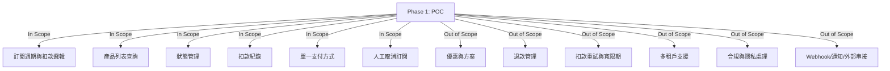

# 自動扣款機器人階段需求說明書 - Phase 1: POC (Proof of Concept)

## 概述
**階段目標**：驗證基本訂閱與扣款邏輯，支援簡單週期計算與狀態管理。忽略優惠、退款與多租戶，聚焦技術可行性。簡化原需求：僅支援月/年週期，無邊緣優惠處理，單一支付方式。

**依賴**：無（起始階段）。  
**輸出**：基本原型系統，證明扣款計算正確性。  
**User Stories**：聚焦核心訂閱與查詢。

---

## 範圍邊界圖 (Scope Diagram)

---

## 主題：訂閱週期與扣款邏輯
- **訂閱扣款週期可自定義**：支援月與年週期，從訂閱開始日計算。基本處理大小月與閏年（例：1/31訂閱，下期2/28或2/29）。
- **每個產品唯一扣款週期**：產品綁定單一週期，不可變更。若需不同週期，定義新產品。
- **扣款週期的計算方式**：支援「曆法週期」（如1個月），忽略固定天數。產品端設定，使用者僅選擇產品。
- **可訂閱產品列表**：使用者查詢產品列表，系統過濾已訂閱產品（無優惠套用）。

## 主題：狀態管理與資料紀錄
- **訂閱狀態與生命週期**：定義基本狀態（待生效、已生效、已取消），簡單流轉規則（訂閱→生效→取消）。
- **扣款歷史與異常記錄**：記錄扣款成功/失敗，無重試機制。

## 主題：系統擴充性與彈性
- **多平台支付支援**：支援單一支付方式（如信用卡）。
- **人工介入與應急流程**：基本人工取消訂閱。

---

## User Stories
| Case | As a | I want | So that |
|------|------|--------|---------|
| 1. | 訂閱用戶 | 系統自動計算扣款日（處理大小月/閏年） | 我不用擔心錯誤收費 |
| 2. | 系統管理者 | 每個產品綁定唯一週期 | 減少規則衝突 |
| 3. | 訂閱用戶 | 查詢產品列表（過濾已訂閱） | 我知道可選方案 |
| 4. | 客服人員 | 查詢訂閱狀態與扣款歷史 | 我能定位基本問題 |

